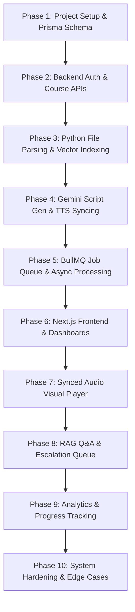

# AI LectureHub — Technical Implementation Plan

**AI LectureHub** is an AI-powered educational platform where teachers upload course materials (PDFs/PPTXs) and an AI pipeline generates spoken lectures synced with visual slides. Students watch lectures, pause to ask questions answered by RAG (Gemini LLM + ChromaDB), and complex/low-confidence queries escalate to teachers.

---

## User Review Required

> [!IMPORTANT]
> 1. **External API Dependencies**: This platform relies on Google Gemini API, Google Cloud Text-to-Speech API, Cloudinary (for file/audio hosting), Resend (for emails), and Redis (for BullMQ queues).
> 2. **Local Python AI Microservice**: The Python service handles PyMuPDF / python-pptx extraction, sentence-transformers embedding generation, and ChromaDB vector indexing.

---

## Proposed System Architecture & Component Breakdown

### 1. Monorepo Root & Configuration
- Root configuration files and [`PROJECT_PHASES.md`](file:///d:/Amperor%20Tech%20Internship%20Projects/AI%20Lecture%20Hub/PROJECT_PHASES.md) documentation.

#### [NEW] [README.md](file:///d:/Amperor%20Tech%20Internship%20Projects/AI%20Lecture%20Hub/README.md)
#### [NEW] [PROJECT_PHASES.md](file:///d:/Amperor%20Tech%20Internship%20Projects/AI%20Lecture%20Hub/PROJECT_PHASES.md)

---

### 2. Backend Service (`/backend`)
Express.js TypeScript backend handling Authentication, Role-based Access Control, Course Management, Lecture Metadata, Queue Jobs (BullMQ), and Progress Tracking.

#### [NEW] [package.json](file:///d:/Amperor%20Tech%20Internship%20Projects/AI%20Lecture%20Hub/backend/package.json)
#### [NEW] [tsconfig.json](file:///d:/Amperor%20Tech%20Internship%20Projects/AI%20Lecture%20Hub/backend/tsconfig.json)
#### [NEW] [.env.example](file:///d:/Amperor%20Tech%20Internship%20Projects/AI%20Lecture%20Hub/backend/.env.example)
#### [NEW] [prisma/schema.prisma](file:///d:/Amperor%20Tech%20Internship%20Projects/AI%20Lecture%20Hub/backend/prisma/schema.prisma)
#### [NEW] [src/index.ts](file:///d:/Amperor%20Tech%20Internship%20Projects/AI%20Lecture%20Hub/backend/src/index.ts)

---

### 3. Python AI Microservice (`/ai-service`)
FastAPI application handling PDF/PPTX parsing, slide image extraction, LangChain text chunking, sentence-transformers vector embeddings, ChromaDB search, Gemini transcript generation, and Google Cloud TTS synthesis.

#### [NEW] [requirements.txt](file:///d:/Amperor%20Tech%20Internship%20Projects/AI%20Lecture%20Hub/ai-service/requirements.txt)
#### [NEW] [.env.example](file:///d:/Amperor%20Tech%20Internship%20Projects/AI%20Lecture%20Hub/ai-service/.env.example)
#### [NEW] [main.py](file:///d:/Amperor%20Tech%20Internship%20Projects/AI%20Lecture%20Hub/ai-service/main.py)

---

### 4. Next.js Frontend Application (`/frontend`)
Next.js 14 App Router application with Tailwind CSS, Shadcn UI components, custom synced HTML5 Audio Player, RAG Q&A interface, and role-based dashboards (Admin, Teacher, Student).

#### [NEW] [package.json](file:///d:/Amperor%20Tech%20Internship%20Projects/AI%20Lecture%20Hub/frontend/package.json)
#### [NEW] [tsconfig.json](file:///d:/Amperor%20Tech%20Internship%20Projects/AI%20Lecture%20Hub/frontend/tsconfig.json)
#### [NEW] [tailwind.config.js](file:///d:/Amperor%20Tech%20Internship%20Projects/AI%20Lecture%20Hub/frontend/tailwind.config.js)
#### [NEW] [.env.example](file:///d:/Amperor%20Tech%20Internship%20Projects/AI%20Lecture%20Hub/frontend/.env.example)

---

## Implementation Roadmap Summary

---

## Verification Plan

### Automated Tests
- Database schema verification via `npx prisma validate`.
- FastAPI endpoints validation via `/docs` (OpenAPI).
- Unit tests for chunking and timestamp alignment algorithms.

### Manual Verification
- **Lecture Upload & Sync**: Upload a multi-page PDF/PPTX and verify audio playback matches displayed slide images.
- **RAG Q&A & Escalation**: Pause lecture and ask a contextual question:
  - Query covered in lecture -> Instant AI response with confidence score.
  - Query out of scope -> Escalates to Teacher Dashboard queue.
- **Progress Persistence**: Leave lecture mid-way and verify playback resumes at exact timestamp.
